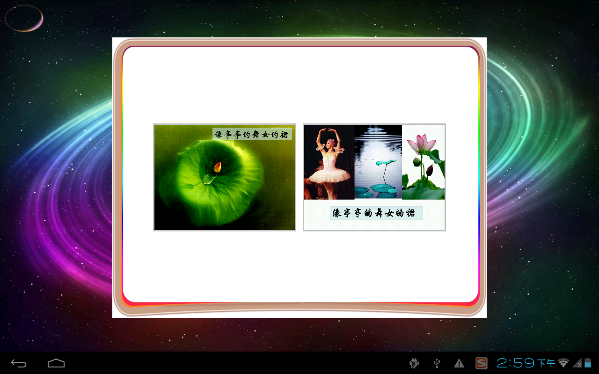

android-exdog
=============

是想做一个android三维自己用的sdk的。一点一点做呗
### 简介###
效果介绍：
* 三维球自转，切围绕中心转动！
* 点击三维球，书从圆心逐渐变大，由透明变实体。
* 翻书效果

图如下：

### 依赖项目 ###

精心选了两个项目框架，一个是android的aquery，一个是三维的rajawali

* 1.将两个项目当成libary引入即可

* 2.其中有bug，是因为读取sdcard中的图片时，没有资源导致的。可以修改一下ex.utils.constan中的chinese

book的路径，该路径中只要有图就可以了，就可以以书的形式打开图。

* 3.其中很多类，暂时没有用到，主要用到的是，subjectFragment,显示三维部分用到的是Exwidget。

* 4.控件包中有两个翻书效果的控件，一个是单面翻书，一个是用glsurface实现的双面翻书
